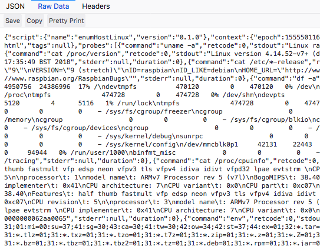
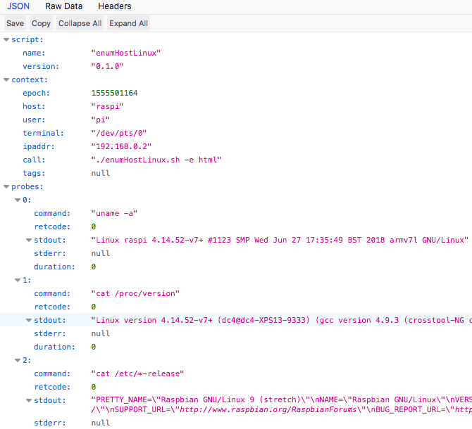
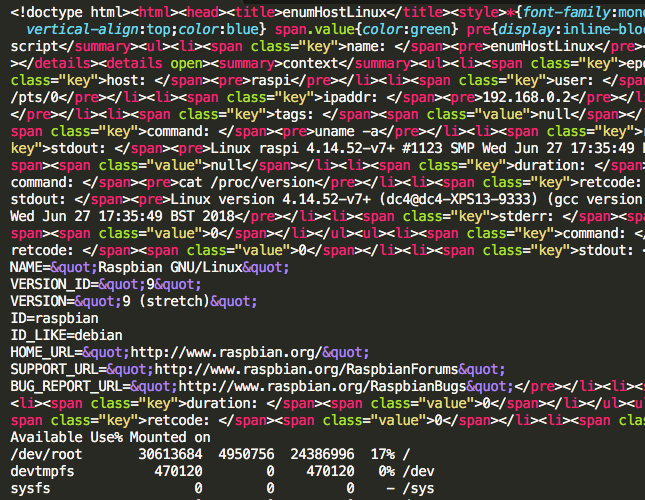
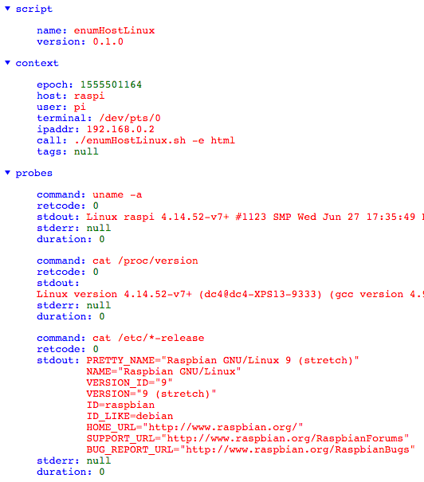

# enumHostLinux

Shell script to run a serie of active enumeration probes on a linux host to spot potential security weaknesses.

Intended to require no user interaction, to have as few binary dependencies as possible and to be legacy-tolerant.

## Getting Started

1. Download the enumHostLinux.sh file or copy-paste its raw content in a file called `enumHostLinux.sh`
2. Make the file executable `chmod +x ./enumHostLinux.sh`
3. Run the executable file `./enumHostLinux.sh`

Use argument "-h" `./enumHostLinux.sh -h` to list all available command-line arguments.

## Command-line Arguments

* -c|--category <n>:    category of probes to be run
  * 0: no probes (dry-run), 1: fast probes (default), 2: medium probes, 3: slow probes
* -s|--sudo <xxx>:      user password to allow sudo scripts (security warning: password will most probably persist in the shell history)
* -t|--temporary <xxx>: directory to store the probe's temporary results (default: '/tmp')
* -d|--directory <xxx>: directory to store the enumeration output (default: '.')
* -p|--prefix <xxx>:    prefix of the final report's file name (timestamp and extension are added automatically)
* -e|--export <xxx>:    format of requested additional output (only 'html' is currently available)
* -t|--tags <xxx>:      csv of arbitrary tags for identification and automated parsing (default: json 'null' value)
* -v|--version:         prints the script's version
* -h|--help:            help message

## Output Formats

The enumeration report will be exported to flat json to allow for easy parsing by vulnerability management tools and CTF scripts.
Although web browsers are good at rendering json content, an additional html report can be requested by the command-line argument `-e html`.

### Default json Output

Raw json:

Rendered json:

### Optional html Export

Raw html:

Rendered html:

## Contributing

All contributions are welcome.

## Versioning

The versioning scheme is fully [SemVer v2.0.0](https://semver.org/spec/v2.0.0.html) compliant.

## License

This project is licensed under the GNU General Public License v3.0 - see the [LICENSE.md](LICENSE.md) file for details.

## Acknowledgments

Largely inspired on Rebootuser's [LinEnum](https://github.com/rebootuser/LinEnum).
